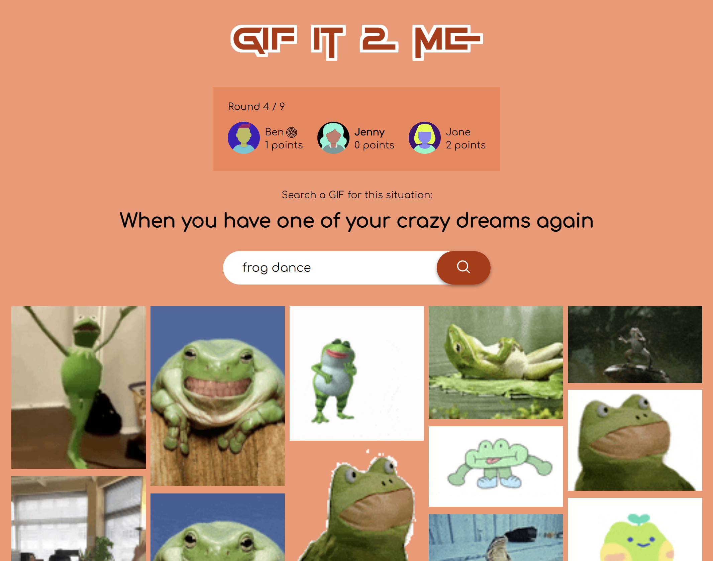

# GIF it 2 me 👾

### 🎮 https://www.gifit2me.com/ 🎮

GIF it 2 me is a turn-based real-time party game for 3 to 9 players that uses the Giphy API.

Each round another player is the master and thinks of a situation (or chooses from a selection of example situations) 
to which the players must find a suitable, preferably funny GIF. They can search the Giphy database to do this.

As soon as all players have submitted a GIF, the master starts to reveal them. Then he decides which of the answers is the 
funniest and chooses it as the winner. The corresponding player receives a point and the role of the master changes to the 
next player, whose turn it is to think up a situation.

The game ends as soon as each player has been master as many times as defined in the number of runs at the
beginning.

## dev

inside **client**: `npm install`, `npm start`

inside **server**: `npm install`, `npm run dev`

## prod

**root**: `npm run build`, `npm run start`
